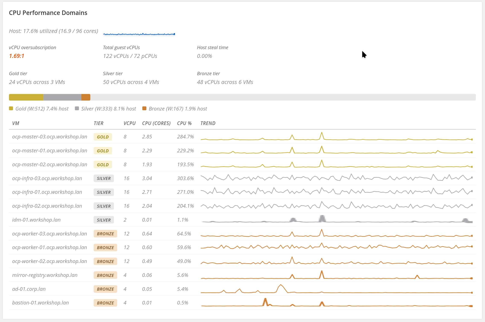
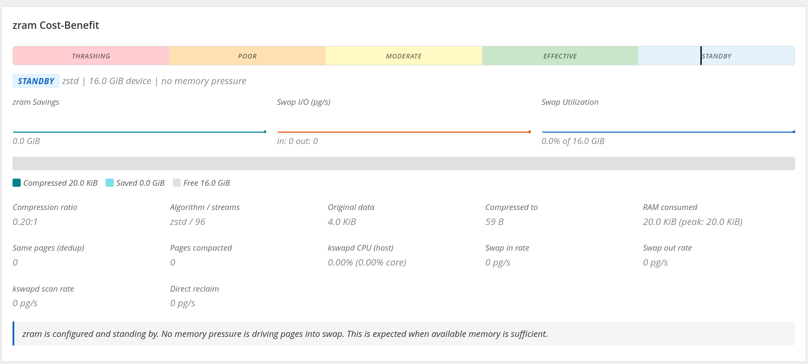

# Calabi Observer

Cockpit plugin that provides real-time observability for Calabi host resource
management.

<a href="../../aws-metal-openshift-demo/docs/host-resource-management.md"><kbd>&nbsp;&nbsp;RESOURCE MANAGEMENT&nbsp;&nbsp;</kbd></a>
<a href="../../aws-metal-openshift-demo/docs/host-memory-oversubscription.md"><kbd>&nbsp;&nbsp;HOST MEMORY&nbsp;&nbsp;</kbd></a>
<a href="../../aws-metal-openshift-demo/docs/README.md"><kbd>&nbsp;&nbsp;DOCS MAP&nbsp;&nbsp;</kbd></a>

## Contents

- [What It Does](#what-it-does)
- [Navigation](#navigation)
- [Panel Screenshots](#panel-screenshots)
- [Architecture](#architecture)
- [Files](#files)
- [Data Sources](#data-sources)
- [Installation](#installation)
- [Requirements](#requirements)
- [Usage](#usage)
- [Security Posture](#security-posture)
- [Tier Colors](#tier-colors)
- [CPU Pool Colors](#cpu-pool-colors)

## What It Does

The observer answers one question: **is the tiered resource management system
working?** It collects kernel, cgroup, and libvirt metrics every 5 seconds and
renders them as tabbed live cards in the Cockpit web console.

Without this plugin, answering that question requires reading a dozen sysfs
files, parsing `virsh` XML, diffing `/proc/stat` samples by hand, and mentally
correlating the results. The observer automates that correlation and adds
cost-benefit verdicts so you can tell at a glance whether KSM, zram, and the
CPU tier model are earning their keep.

## Navigation

| Tab | Cards |
| --- | --- |
| **CPU** | CPU overview, overhead/disposition, performance domains, CPU pool topology, effective constrained clock |
| **Memory** | Memory overview, memory-management overhead, KSM cost-benefit, zram cost-benefit, per-VM attribution |
| **Configuration** | Direct exporter status, bind/firewall settings, node_exporter migration status |

## Panel Screenshots

### KSM Cost-Benefit


### CPU Performance Domains



### CPU Pool Topology


### Memory Overview


### zram Cost-Benefit



### Memory Overview Overheads


## Architecture

```
┌───────────────────────────────────────────────────────┐
│  Browser (Cockpit web console)                        │
│  ┌─────────────────────────────────────────────────┐  │
│  │  calabi-observer.js                             │  │
│  │  - watches /run/calabi-observer/metrics.json    │  │
│  │  - computes deltas between samples              │  │
│  │  - renders DOM + canvas sparklines              │  │
│  └──────────────────────┬──────────────────────────┘  │
└─────────────────────────┼─────────────────────────────┘
                          │ cockpit-ws / cockpit-bridge
┌─────────────────────────┼─────────────────────────────┐
│  host (as root)         │                             │
│  ┌──────────────────────▼──────────────────────────┐  │
│  │  calabi-exporter.service                        │  │
│  │  - persistent daemon owns collection cadence     │  │
│  │  - writes Cockpit JSON snapshot                  │  │
│  │  - serves cached Prometheus metrics on :9910     │  │
│  └──────────────────────┬──────────────────────────┘  │
│  ┌──────────────────────▼──────────────────────────┐  │
│  │  collector.py                                   │  │
│  │  - reads /proc/meminfo, /proc/stat, /proc/vmstat│  │
│  │  - reads /sys/kernel/mm/ksm/*, /sys/block/zram* │  │
│  │  - reads cgroup v2 cpu.stat per tier and domain │  │
│  │  - reads /proc/<pid>/stat for kernel threads    │  │
│  │  - (full mode) runs virsh list + virsh dumpxml  │  │
│  │  - returns a metrics dictionary to the daemon    │  │
│  └─────────────────────────────────────────────────┘  │
└───────────────────────────────────────────────────────┘
```

The direct Calabi exporter uses a **two-speed collection model**:

- **Fast collection** (default 5s): reads only sysfs, procfs, and cgroups. Completes
  in ~50ms. Provides CPU, memory, KSM, zram, and cached per-domain attribution
  without touching libvirt.
- **Full collection** (60s): full collection including `virsh list` + `virsh dumpxml`
  for each running domain. Takes 1-2s. Refreshes the domain list, tier
  assignments, vCPU counts, and memory commitments.

Prometheus scrapes read cached output from `GET /metrics`; scrapes do not
trigger collection. Cockpit reads the same latest sample from
`/run/calabi-observer/metrics.json`.

Delta computation happens in the browser. The collector emits cumulative
counters (CPU ticks, cgroup `usage_usec`, KSM `full_scans`); the frontend watches
the daemon snapshot, diffs
consecutive samples and divides by elapsed time to produce rates.

## Files

| File | Purpose |
| --- | --- |
| `manifest.json` | Cockpit sidebar registration and CSP policy |
| `index.html` | HTML shell with panel structure |
| `collector.py` | Backend metrics collector used by the persistent exporter |
| `calabi_exporter.py` | Direct exporter that writes the Cockpit snapshot and serves cached `/metrics` |
| `prometheus_control.py` | Narrow privileged control surface for direct exporter settings |
| `calabi-observer.js` | Frontend: snapshot watching, delta computation, DOM rendering |
| `sparkline.js` | Canvas sparkline and stacked bar renderer (~170 lines) |
| `calabi-observer.css` | Styling: cards, gauges, bars, tables, heatmap cells |
| `cockpit-calabi-observer.spec` | RPM spec file |
| `build-rpm.sh` | RPM build script |

No build step. No React. No bundler. Vanilla JS + PatternFly CSS classes from
Cockpit's `base1`.

## Data Sources

| Source | What | Poll mode |
| --- | --- | --- |
| `/proc/meminfo` | MemTotal, MemAvailable, Cached, AnonPages, Slab, etc. | fast + full |
| `/proc/stat` | host-wide and per-CPU jiffies (user, system, idle, iowait, steal) | fast + full |
| `/proc/vmstat` | pswpin, pswpout, pgsteal, pgscan counters | fast + full |
| `/proc/cpuinfo` | per-CPU clock frequency in MHz | fast + full |
| `/sys/kernel/mm/ksm/*` | pages_shared, pages_sharing, pages_volatile, full_scans, ksm_zero_pages | fast + full |
| `/sys/kernel/mm/transparent_hugepage/*` | enabled mode, defrag mode | fast + full |
| `/sys/block/zram*/mm_stat` | orig_data, compr_data, mem_used, same_pages, pages_compacted | fast + full |
| `/sys/block/zram*/io_stat` | failed_reads, failed_writes, invalid_io | fast + full |
| `/sys/block/zram*/stat` | block device I/O counters (reads, writes, in-progress) | fast + full |
| `/sys/block/zram*/{disksize,mm_stat,comp_algorithm,max_comp_streams,bd_stat,backing_dev}` | zram size, compression, writeback, and backing-device state | fast + full |
| `/proc/swaps` | per-device swap size, used bytes, and priority | fast + full |
| `/proc/<pid>/stat` for ksmd, kswapd0/1, kcompactd0/1 | cumulative utime+stime ticks | fast + full |
| `/proc/<qemu-pid>/ksm_stat` and `/proc/<qemu-pid>/status` | per-VM KSM profit and swap pressure attribution | fast with cached domains + full |
| `/sys/fs/cgroup/machine.slice/machine-{gold,silver,bronze}.slice/cpu.stat` | usage_usec, nr_throttled, throttled_usec | fast + full |
| Per-domain cgroup `cpu.stat` | per-VM usage_usec (discovered by scanning cgroup tree) | fast + full |
| `virsh list` + `virsh dumpxml` | CPU pool detection, per-domain memory, vcpus, UUID, partition, tier classification | full only |

## Installation

### From RPM

```bash
scp rpmbuild/RPMS/noarch/cockpit-calabi-observer-1.2.3-1.fc43.noarch.rpm <host>:
ssh <host> 'sudo dnf install -y ./cockpit-calabi-observer-1.2.3-1.fc43.noarch.rpm'
```

### From source (rsync)

```bash
rsync -av /path/to/cockpit/calabi-observer/ <host>:/opt/cockpit-calabi-observer/
ssh <host> 'ln -snf /opt/cockpit-calabi-observer /usr/share/cockpit/calabi-observer'
```

Cockpit picks up new plugins on page load. No service restart needed.

### Migration from the textfile exporter

Calabi-specific Prometheus metrics now come from the direct exporter:

```text
http://127.0.0.1:9910/metrics
```

The old v1 path exposed Calabi metrics through node_exporter's textfile
collector on port `9100`. This refactor intentionally separates those concerns:
`calabi-exporter.service` serves Calabi metrics on `9910`, while node_exporter
may still run on `9100` for generic host metrics. Prometheus jobs that used to
scrape one combined `:9100` endpoint should add a second scrape target for
`:9910` or relabel the new Calabi job accordingly.

### Building the RPM

```bash
./build-rpm.sh
# Output: rpmbuild/RPMS/noarch/cockpit-calabi-observer-*.noarch.rpm
#         rpmbuild/SRPMS/cockpit-calabi-observer-*.src.rpm
```

`rpmbuild/` is generated output and intentionally ignored by git. Do not
commit built RPMs or generated source tarballs.

## Requirements

- `cockpit-system` and `cockpit-bridge` (Cockpit 219+)
- `python3`
- `libvirt-client` (provides `virsh`)
- `firewalld` when using the Cockpit firewall exposure toggle
- Root access (collector reads sysfs, procfs, and cgroups; virsh requires
  system connection)

## Usage

Navigate to **Calabi Observer** in the Cockpit sidebar. The plugin starts
watching the daemon snapshot immediately.

Controls:

- **Pause/Resume**: stop and resume snapshot watching
- **Collection interval**: configured in the Calabi Prometheus Export panel; this controls how often the exporter writes new samples
- **Status dot**: green = healthy, amber = paused, red = collection error

Append `?debug=1` to the URL to enable console logging of each sample.

## Tier Colors

Consistent across all panels:

| Tier | Color | Hex |
| --- | --- | --- |
| Gold | yellow | `#c9b037` |
| Silver | grey | `#a8a9ad` |
| Bronze | copper | `#cd7f32` |

## CPU Pool Colors

Used in the CPU Pool Topology heatmap:

| Pool | Color | Hex |
| --- | --- | --- |
| Host Housekeeping | blue | `#1565c0` |
| Host Emulator | purple | `#7b1fa2` |
| Guest Domain | green | `#2e7d32` |

## Security Posture

The UI runs inside Cockpit's existing authentication and authorization
boundary. The direct Prometheus exporter binds to `127.0.0.1:9910` by default
and keeps the firewall closed unless the operator explicitly changes both the
listen address and firewall policy. TLS/basic auth for direct network exposure
is intentionally deferred.

**Rating: A-**

> [!NOTE]
> The only residual finding is `script-src 'unsafe-inline'` in the Content
> Security Policy. This is required by the Cockpit framework itself — all
> Cockpit plugins inherit it. The plugin's own code never uses `eval()`,
> `innerHTML`, or inline event handlers. Removing `unsafe-inline` would
> require an upstream Cockpit platform change.

Strengths:

| Area | Detail |
| --- | --- |
| No command injection | `collector.py` uses `subprocess.run()` with list arguments exclusively. No shell expansion, no string interpolation into commands. |
| XSS resistant | All DOM content is set via `textContent` and `setAttribute`. The frontend never assigns `innerHTML` from collected data. |
| No external dependencies | Zero third-party Python or JS libraries. The collector uses only the Python standard library; the frontend uses only Cockpit's `base1` and native browser APIs. |
| Read-only collector | The collector reads sysfs, procfs, cgroups, and virsh XML. It never writes to the host. |
| Input validation | The collector uses `argparse` for CLI argument parsing. The only accepted flag is `--fast`. |
| Auth delegation | Authentication and session management are handled entirely by Cockpit. The plugin declares `superuser: "require"` in `manifest.json`, so Cockpit enforces privilege escalation through its own sudo bridge. |

Residual notes:

- The collector runs as root (via Cockpit's superuser channel) because the data
  sources it reads — `/sys/kernel/mm/ksm/*`, cgroup `cpu.stat` files, `virsh`
  system connection — require root privileges. The collector does not drop
  privileges after startup because every read path requires them.
- Error messages from the collector are written to stderr as JSON
  (`{"error": "..."}`) and are not rendered into the DOM.
