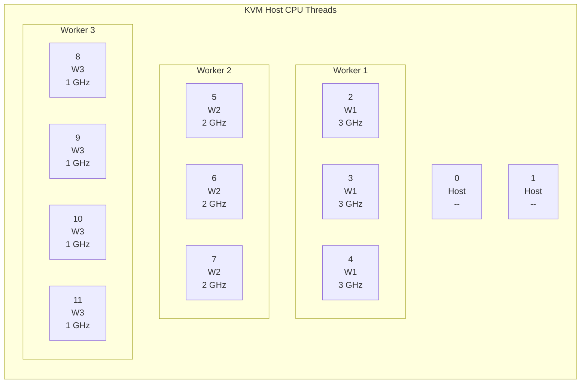

# Clock Frequency Tiering

This is the optional clock-tiering experiment.

Use it when you want deterministic per-worker CPU lanes with per-lane max
frequency caps.

> [!WARNING]
> Do not treat this as the shared execution pool path. It is a different
> operating model.

## Live Shape

Current intended layout:



Policy:

| VM              | vCPU cpuset | Emulator cpuset | Max frequency |
| --------------- | ----------- | --------------- | ------------- |
| `kvm-worker-01` | `2-4`       | `0-1`           | `3000000 kHz` |
| `kvm-worker-02` | `5-7`       | `0-1`           | `2000000 kHz` |
| `kvm-worker-03` | `8-11`      | `0-1`           | `1000000 kHz` |

## What `clock-apply` Does

`./scripts/host-resource-management.sh clock-apply`:

1. widens the live scope cpuset so libvirt pinning can take effect
2. pins each worker vCPU set to its dedicated lane
3. pins each emulator thread to `0-1`
4. writes the per-CPU frequency caps under `/sys/devices/system/cpu/.../cpufreq`

## Apply

```bash
cd /path/to/stakkr
./scripts/host-resource-management.sh clock-apply
./scripts/host-resource-management.sh clock-status
```

## Rollback

```bash
./scripts/host-resource-management.sh clock-rollback
./scripts/host-resource-management.sh clock-status
```

After rollback you should see:

- `virsh vcpupin` back to `0-11`
- `virsh emulatorpin` back to `0-11`
- `scaling_max_freq` restored to `cpuinfo_max_freq`

> [!TIP]
> `clock-rollback` removes the clock experiment. If you want to go back to the
> shared-pool path afterward, run
> `./scripts/host-resource-management.sh shared-execution-pool-apply`.

## Why It Is Separate

Clock tiering does not use a shared guest execution pool. Each worker owns a
dedicated lane, so it is intentionally different from the shared-pool
Gold/Silver/Bronze cgroup model.
