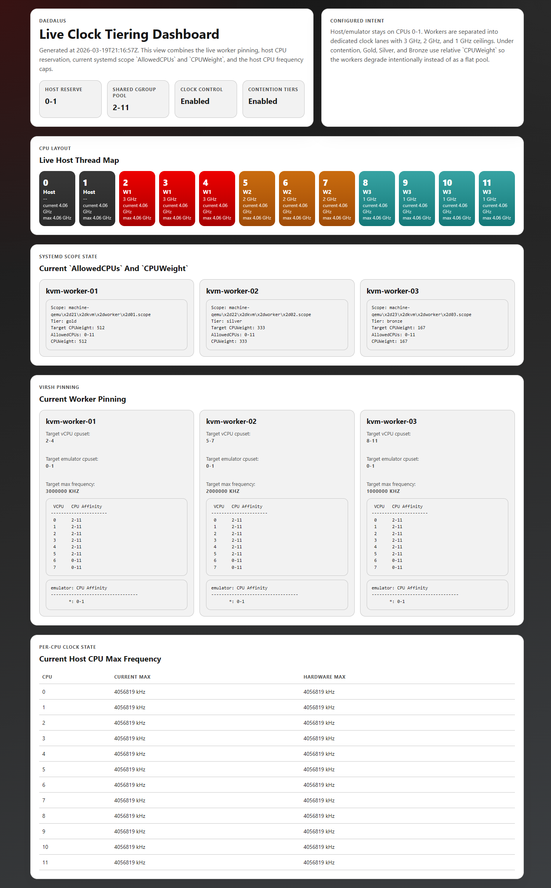
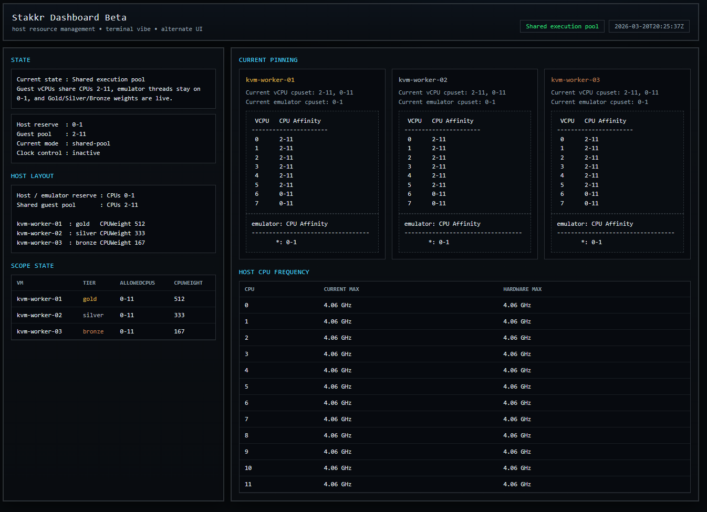

# Dashboard

The dashboard is optional. Use it when you want one page that shows the current
snapshot instead of checking multiple commands by hand.

There are now two UI choices:

- the current dashboard in `dashboard/`
- the beta dashboard in `dashboard-beta/`

Both use the same generated live-state JSON. The beta dashboard is only an
alternate UI surface.

The UI is checked into git:

- `dashboard/index.html`
- `dashboard/app.js`
- `dashboard/server.py`

The live data is generated locally:

- `generated/dashboard/live-state.json`

It shows the host in one of four states:

- stock
- shared execution pool
- clock-tiering
- mixed

That makes it easier to tell, at a glance, whether the host is still untouched,
in the default shared execution pool model, in the separate clock experiment,
or somewhere in between.

> [!IMPORTANT]
> The dashboard is a snapshot, not a streaming view. Re-render it when you want
> fresh state.

> [!NOTE]
> The workflow prefers non-interactive `sudo` when it is available. If it is
> not, it falls back to the normal Ansible become-password prompt.

## What It Shows

- current state summary
- current `AllowedCPUs`
- current `CPUWeight`
- current `virsh vcpupin`
- current `virsh emulatorpin`
- current per-CPU max frequency
- current CPU layout

## One Command

From the repo root, render the dashboard and start the dedicated dashboard server:

```bash
cd /path/to/stakkr
./scripts/dashboard-workflow.sh serve
```

By default, the server listens on port `8081`.

Open:

```text
http://localhost:8081/
```

The command keeps running until you stop it.

## Beta Dashboard

The beta dashboard is self-contained in `dashboard-beta/` and coexists with the
current UI.

Render and serve it with:

```bash
cd /path/to/stakkr
./scripts/dashboard-beta-workflow.sh serve
```

By default, the beta server listens on port `8082`.

Open:

```text
http://localhost:8082/
```

If you want to reach the beta dashboard from another machine, open port `8082`
on the host firewall and use the host IP instead of `localhost`:

```bash
sudo firewall-cmd --add-port=8082/tcp --permanent
sudo firewall-cmd --reload
```

Then browse to:

```text
http://<host>:8082/
```

## Use A Different Port

If `8081` is already in use, pass a different port:

```bash
cd /path/to/stakkr
./scripts/dashboard-workflow.sh serve 9090
```

Then open:

```text
http://localhost:9090/
```

## Render Only

```bash
cd /path/to/stakkr
./scripts/dashboard-workflow.sh render
```

Generated files:

- `generated/dashboard/live-state.json`

The server only exposes:

- `/`
- `/index.html`
- `/app.js`
- `/live-state.json`
- `/healthz`

It does not expose the repo root or a directory listing.

## Remote Access

If you want to reach the main dashboard from another machine and you are using
the default port:

```bash
sudo firewall-cmd --add-port=8081/tcp --permanent
sudo firewall-cmd --reload
```

Then browse to:

```text
http://<host>:8081/
```

If you serve it on a different port, open that port instead and use that URL.

## Refresh

The page is static. Regenerate it when you want fresh live state:

```bash
cd /path/to/stakkr
./scripts/dashboard-workflow.sh render
```

## Preview

Standard dashboard:



Beta dashboard:


