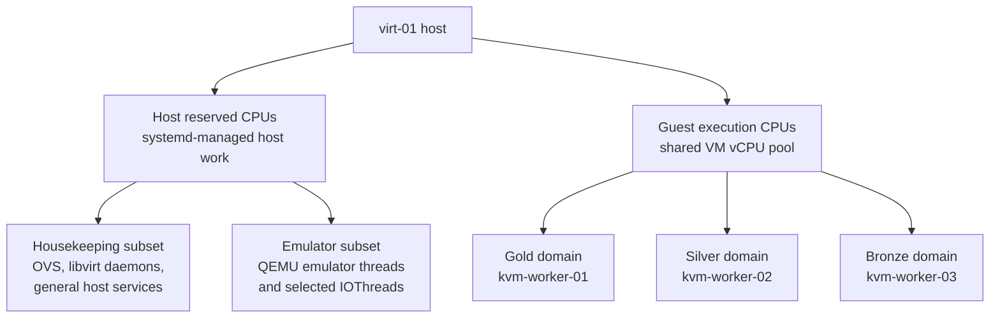
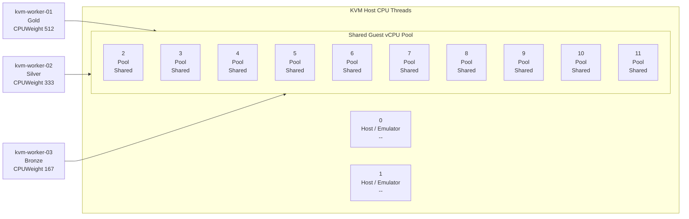

# Shared Execution Pool With Weighted Performance Domains

This is the default operating path.

In plain terms:

- the host keeps a small CPU reserve for host and emulator work
- all worker vCPUs share one larger guest CPU pool
- Gold, Silver, and Bronze decide who gets more CPU when that pool is busy

> [!IMPORTANT]
> This is not the clock-tiering experiment. If you want dedicated worker lanes
> with per-lane frequency caps, use [clock-frequency-tiering.md](./clock-frequency-tiering.md) instead.

## Design Summary

The live shape diagram later in this page shows the exact CPU layout in use on
this host. The idea behind it is simpler:

- the host keeps a reserved CPU subset for systemd-managed host work
- emulator and selected IO threads stay in that reserved space
- guest vCPU threads compete in one shared execution pool
- Gold, Silver, and Bronze domains bias scheduler behavior when the pool is busy



That separation matters because it avoids a flat scheduler pool. Host work,
emulator work, and guest vCPU work are not treated as one undifferentiated
bucket.

## Live Shape

Current intended layout:

- host reserve: `0-1`
- guest execution pool: `2-11`
- emulator threads: `0-1`



Performance domain mapping:

| VM | Tier | `CPUWeight` |
| --- | --- | --- |
| `kvm-worker-01` | Gold | `512` |
| `kvm-worker-02` | Silver | `333` |
| `kvm-worker-03` | Bronze | `167` |

Important behavior:

- Gold, Silver, and Bronze are weighted performance domains, not hard reservations
- idle CPU can still be borrowed
- vCPU placement and emulator placement are separate concerns
- the shared execution pool path is the default operating model on this host

## What `shared-execution-pool-apply` Does

`./scripts/host-resource-management.sh shared-execution-pool-apply` does the
whole default live shared execution pool setup.

It assumes the managed worker domains already exist and are running:

- `kvm-worker-01`
- `kvm-worker-02`
- `kvm-worker-03`

That is because this is a live VM policy action, not a VM creation action. The
host foundation commands can be applied before those guests exist, but the
shared execution pool action cannot.

It does two things:

1. placement
   - widens the live VM scope `AllowedCPUs` to `0-11`
   - pins guest vCPU threads to `2-11`
   - pins emulator threads to `0-1`
2. weighting
   - applies Gold, Silver, and Bronze `CPUWeight`

After that, the host is in the intended shared execution pool shape:

- shared guest execution pool
- reserved host/emulator pair
- intentional degradation through weighted performance domains

## Host Foundation

The live shared execution pool controls sit on top of a host-side foundation
policy.

Apply that host foundation once per host:

```bash
./scripts/host-resource-management.sh host-resource-management-apply
./scripts/host-resource-management.sh host-resource-management-rollback
./scripts/host-resource-management.sh host-resource-management-status
./scripts/host-resource-management.sh host-memory-oversubscription-apply
./scripts/host-resource-management.sh host-memory-oversubscription-rollback
./scripts/host-resource-management.sh host-memory-oversubscription-status
```

That host layer is split into two parts:

- `host-resource-management-*`
  - reserved CPU policy for the host
  - Gold, Silver, and Bronze slice definitions
- `host-memory-oversubscription-*`
  - host memory-efficiency policy for zram, THP, and KSM

It is not the same thing as the live `shared-execution-pool-apply` action. The
host foundation shapes the machine itself. The live shared execution pool
action shapes the running VM scopes and pinning on top of that host baseline.

## Recommended Operator Flow

> [!NOTE]
> You only need this cleanup step when the host may already have old controls
> applied. It is not part of the normal day-to-day apply flow.
>
> ```bash
> cd /path/to/stakkr
> ./scripts/host-resource-management.sh clock-rollback
> ./scripts/host-resource-management.sh shared-execution-pool-rollback
> ```

Apply the host foundation first:

```bash
./scripts/host-resource-management.sh host-resource-management-apply
./scripts/host-resource-management.sh host-memory-oversubscription-apply
```

At this point the host foundation is in place, but the live shared execution
pool model is not active yet unless the managed worker VMs already exist.

Deploy or confirm these workers before the next step:

- `kvm-worker-01`
- `kvm-worker-02`
- `kvm-worker-03`

Apply the shared execution pool model:

```bash
./scripts/host-resource-management.sh shared-execution-pool-apply
```

Verify:

```bash
./scripts/host-resource-management.sh host-resource-management-status
./scripts/host-resource-management.sh host-memory-oversubscription-status
./scripts/host-resource-management.sh shared-execution-pool-status
```

Those status commands are direct live checks, not Ansible status playbooks.
They read the current host and VM state with commands such as `systemctl show`,
`virsh vcpupin`, `virsh emulatorpin`, and `/sys` reads.

What you should see:

- scope `AllowedCPUs=0-11`
- `virsh vcpupin` showing guest vCPUs on `2-11`
- `virsh emulatorpin` showing `0-1`
- `CPUWeight` of `512`, `333`, and `167`

> [!TIP]
> `shared-execution-pool-status` is the normal verification command for the
> live VM policy layer. It answers the big question:
> "What live shared execution pool state is active right now?"
>
> It shows:
>
> - the overall host state summary
> - the current scope properties
> - the live vCPU pinning
> - the live emulator pinning
>
> Use `contention-status` only when you want the narrow contention view. It
> answers the smaller question: "Which Gold / Silver / Bronze weights are live
> right now?"
>
> It shows:
>
> - the intended tier for each VM
> - the target `CPUWeight`
> - the current live `CPUWeight`
>
> Example:
>
> ```bash
> ./scripts/host-resource-management.sh contention-status
> ```

## Lower-Level Controls

Most operators do not need these. They are here when you want to inspect one
layer at a time:

```bash
./scripts/host-resource-management.sh contention-apply
./scripts/host-resource-management.sh contention-rollback
./scripts/host-resource-management.sh contention-status
```

Those are no longer required for the normal operator flow.

## Rollback

Undo the full shared execution pool model:

```bash
./scripts/host-resource-management.sh shared-execution-pool-rollback
```

That restores stock `0-11` pinning, resets the contention weights, and removes
the live scope overrides.

## Validation

Measured weighted-domain results are summarized here:

- [shared-execution-pool-validation.md](./shared-execution-pool-validation.md)
